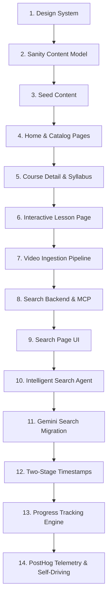
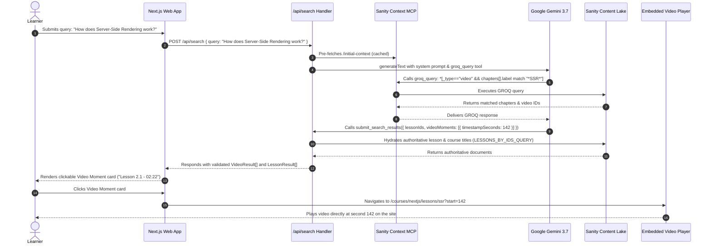

# Msingi AI-Powered E-Learning Platform
## Comprehensive Technical Architecture, Agent System, Skills & Implementation Report

---

## Executive Summary

**Msingi** (Swahili for *"Foundation"*) is a production-grade, AI-powered e-learning platform engineered to revolutionize educational content discovery and mastery. Unlike traditional course platforms where search is confined to static titles or broad tags, Msingi introduces **intelligent content search with sub-second video timestamp precision**: a learner can formulate a natural-language question or conceptual query, and the system immediately surfaces ranked, grounded result cards linking directly to the exact second (`?start=seconds`) in an embedded video lesson where that concept is explained.

This platform was built following rigorous architectural boundaries:
- **Two Standalone Workspaces**: A decoupled Next.js 16 (App Router) web application and an independent Sanity Studio v5 workspace.
- **Dual-Model Intelligent Search**: Orchestrated via the Vercel AI SDK, powered primarily by Google Gemini (`gemini-3.7-flash`) with OpenAI (`o3-mini`) fallback, querying Sanity's private dataset through the Sanity Context Model Context Protocol (MCP) server.
- **Two-Stage Timestamp Resolution**: Chapter markers (table of contents) are matched first as clean semantic milestones, falling back to granular transcript chunks only when necessary.
- **Structural Grounding**: The LLM acts purely as a query planner and extractor, returning strictly validated document IDs and timestamps; full hydration of titles, slugs, and module context is performed authoritatively on the server to eliminate hallucinations.
- **Dynamic Learner Progress Engine**: Keyed strictly to Clerk authentication identities, initializing all learners at a pristine 0% baseline and dynamically calculating course and module progress percentages.
- **Dual-Sided Product Telemetry**: Integrated with PostHog across both client browser hooks and server-side route handlers, backed by automated Self-Driving AI scouts and Replay Vision scanners.

---

## Table of Contents

1. [Architectural Philosophy & Hard Constraints](#1-architectural-philosophy--hard-constraints)
2. [The Prompt-Driven Evolution: 21 Iteration Milestones](#2-the-prompt-driven-evolution-21-iteration-milestones)
3. [Deep Dive into Agent Architecture](#3-deep-dive-into-agent-architecture)
4. [The Skills Library & Applied Instructions](#4-the-skills-library--applied-instructions)
5. [Design System & UI Reproduction](#5-design-system--ui-reproduction)
6. [API & Service Integrations](#6-api--service-integrations)
7. [Learner Progress & State Engine](#7-learner-progress--state-engine)
8. [End-to-End System Flows & Architectural Diagrams](#8-end-to-end-system-flows--architectural-diagrams)
9. [Security, Performance & Operational Guarantees](#9-security-performance--operational-guarantees)

---

## 1. Architectural Philosophy & Hard Constraints

Msingi was architected under strict core engineering tenets defined in `AGENTS.md`:

```
                    ┌──────────────────────────────────────────────┐
                    │               msingi Monorepo                │
                    └───────┬──────────────────────────────┬───────┘
                            │                              │
             ┌──────────────▼─────────────┐ ┌──────────────▼─────────────┐
             │       Web Workspace        │ │      Studio Workspace      │
             │   Next.js 16 (App Router)  │ │      Sanity Studio v5      │
             │   React 19 / Tailwind v4   │ │   Standalone Studio App    │
             │   Clerk Auth / PostHog     │ │   Schema / Content Lake    │
             └────────────────────────────┘ └────────────────────────────┘
```

### 1.1 Strict Boundary Separation
1. **Independent Studio & Web**: The Studio is never embedded inside Next.js. Keeping them isolated preserves independent deployments, zero build coupling, automatic Studio dependency updates, and flawless Sanity TypeGen operations.
2. **Private Dataset Isolation**: The Sanity dataset is private. No Sanity read or write tokens ever reach the client browser. All content queries, mutations, and MCP communications execute exclusively within server-side environments (`serverClient.ts`, `writeClient.ts`, and API Route Handlers).
3. **Presentational vs Functional Surfaces**: Public catalog browsing, course overviews, lesson notes, and search are entirely public. State mutation (lesson completion, resume timestamp tracking) requires verified Clerk authentication through server route handlers.
4. **On-Site Playback Invariant**: Video playback never redirects learners outside the application to YouTube or Vimeo. Embedded players dynamically seek to the requested second (`?start=N`) directly on the lesson view.
5. **No Hallucinations (Strict Grounding)**: The LLM is never permitted to synthesize ungrounded courses, instructors, lessons, or arbitrary timestamps. What is displayed must be authoritatively backed by real documents in the Content Lake.

---

## 2. The Prompt-Driven Evolution: 21 Iteration Milestones

The platform was built through a disciplined, prompt-driven engineering loop where each functional capability was authored as a comprehensive specification prompt in `prompts/` prior to implementation:



### Complete Summary of the 21 Iteration Prompts:

| # | Specification Prompt | Core Objective & Architectural Outcome |
|---|---|---|
| 1 | `msingi-design-system.md` | Extracted tokens, color schemes, typography, and card structures from Figma/desktop reference images into modern Tailwind CSS v4 variables. |
| 2 | `sanity-content-model.md` | Defined the core document schemas (`course`, `lesson`, `video`, `instructor`, `category`) and embedded objects (`module`, `learningOutcome`, `resource`). |
| 3 | `seed-sample-content.md` | Created realistic multi-module course datasets, verified references, and established initial category hierarchies. |
| 4 | `msingi-home.md` | Implemented the responsive home landing page featuring hero search, featured courses, value propositions, and category badges. |
| 5 | `all-courses-page.md` | Built the full catalog browsing view with real-time category filtering, level badges, and course card metrics. |
| 6 | `course-detail-page.md` | Created the comprehensive course landing view displaying the syllabus, module lesson trees, learning outcomes, instructor bios, and enroll/continue CTAs. |
| 7 | `lesson-page.md` | Developed the full interactive lesson surface with responsive video embed, expandable module sidebar, rich Portable Text notes, key points, and resource downloads. |
| 8 | `video-ingestion-pipeline.md` | Engineered offline Node.js tooling to extract chapter markers and split caption tracks into timestamped chunks (`{ startSeconds, text }`). |
| 9 | `actual-video-transcripts-and-intelligence.md` | Ingested real-world YouTube/Vimeo transcripts, populated `video` documents, and verified second-level accuracy. |
| 10 | `search-backend.md` | Established the server-side search route handler (`/api/search`), JSON-RPC MCP connection, and schema validation. |
| 11 | `search-page-ui.md` | Built the standalone search interface rendering dual card types: Video Moments and Lesson Cards, with sorting controls and empty states. |
| 12 | `intelligent-search.md` | Wired LLM reasoning to GROQ generation over the Sanity Context MCP endpoint, handling token matching and disjunctions. |
| 13 | `msingi-intelligent-search.md` | Refined prompt rules to enforce structural grounding and eliminate conversational prose in search API payloads. |
| 14 | `google-gemini-search.md` | Integrated Google Generative AI (`@ai-sdk/google` with `gemini-3.7-flash`) as the primary high-speed reasoning model with OpenAI fallback. |
| 15 | `two-stage-search-and-timestamped-playback.md` | Enforced two-stage resolution: matching chapter TOC entries first for clean titles, falling back to transcript chunks only when needed. |
| 16 | `add-search-result-hrefs.md` | Standardized internal deep links on all search cards (`/courses/[slug]/lessons/[lessonSlug]?start=N`) to seamlessly trigger playback. |
| 17 | `course-access-and-relevant-thumbnails.md` | Resolved video poster and course cover fallbacks, ensuring crisp visual assets across all search cards. |
| 18 | `fix-continue-learning-button.md` | Corrected dynamic routing on "Continue Learning" buttons to accurately resolve the user's latest in-progress lesson. |
| 19 | `fix-progress-tracking-and-readme.md` | Fixed guest baseline to 0%, resolved optimistic state race conditions, and updated comprehensive documentation. |
| 20 | `posthog-tracking-features.md` | Instrument engagement events across catalog views, video watch depth (25%, 50%, 75%, 90%), and lesson completions. |
| 21 | `posthog-event-alignment.md` | Standardized property taxonomies between client PostHog Web SDK and server-side PostHog Node client with explicit event flushing. |

---

## 3. Deep Dive into Agent Architecture

Msingi utilizes multiple specialized AI agents across search, context engineering, and autonomous observability:

```
                                  ┌──────────────────────────────────────────────┐
                                  │             Learner Query: "SSR"             │
                                  └──────────────────────┬───────────────────────┘
                                                         │
                                           ┌─────────────▼────────────┐
                                           │ POST/GET /api/search     │
                                           │ Next.js App Router       │
                                           └─────────────┬────────────┘
                                                         │
                                  ┌──────────────────────▼───────────────────────┐
                                  │   Cached Initial Context Pre-fetch           │
                                  │   https://api.sanity.io/.../initial-context  │
                                  └──────────────────────┬───────────────────────┘
                                                         │
                                  ┌──────────────────────▼───────────────────────┐
                                  │   Intelligent Search Agent                   │
                                  │   Google Gemini 3.7 Flash / OpenAI o3-mini   │
                                  │   Vercel AI SDK generateText (maxSteps: 6)   │
                                  └──────────────┬───────────────▲───────────────┘
                                                 │               │
                                  groq_query     │               │ Result
                                                 ▼               │ Data
                                  ┌──────────────────────────────┴───────────────┐
                                  │   Sanity Context MCP Server                  │
                                  │   JSON-RPC 2.0 (groq_query, schema_explorer) │
                                  └──────────────┬───────────────────────────────┘
                                                 │
                                                 ▼
                                  ┌──────────────────────────────────────────────┐
                                  │   submit_search_results Tool Call            │
                                  │   strictly returns: { lessonIds, moments }   │
                                  └──────────────┬───────────────────────────────┘
                                                 │
                                                 ▼
                                  ┌──────────────────────────────────────────────┐
                                  │   Server Hydration & Grounding               │
                                  │   LESSONS_BY_IDS_QUERY -> Authoritative Data │
                                  │   Derives Module/Lesson Index (e.g. 5.1)     │
                                  └──────────────┬───────────────────────────────┘
                                                 │
                                                 ▼
                                  ┌──────────────────────────────────────────────┐
                                  │   Client Render: Video Moments + Lessons     │
                                  └──────────────────────────────────────────────┘
```

### 3.1 The Intelligent Search Agent (`app/lib/search/search-engine.ts`)

The search agent is an AI reasoning engine operating inside Next.js server-side route handlers.

#### Core Operational Mechanics:
1. **Schema Pre-fetching (`/initial-context`)**:
   Instead of spending LLM turns discovering schema definitions, the search engine pre-fetches compressed schema metadata from the Sanity Context HTTP endpoint (`/initial-context`) and injects it directly into the system prompt. This cuts initial search latency in half and primes prompt caches.
2. **Tool-Calling Execution Loop**:
   The engine configures `generateText` with `maxSteps: 6` and equips the model with two tools:
   - `groq_query`: Accepts dynamic GROQ queries and executes them against Sanity via MCP.
   - `submit_search_results`: The terminal tool receiving grounded lesson IDs and video moment timestamps.
3. **Dual Model Orchestration**:
   - Primary: **Google Gemini 3.7 Flash** (`@ai-sdk/google`), providing high-speed token generation and accurate GROQ syntax.
   - Fallback: **OpenAI o3-mini** (`@ai-sdk/openai`), configured with low reasoning effort.
4. **Structural Grounding Guardrail**:
   The LLM is strictly forbidden from returning formatted markdown or synthesized course metadata. It outputs only:
   ```typescript
   {
     lessonIds: string[],
     videoMoments: Array<{
       lessonId: string,
       timestampSeconds: number,
       chapterLabel: string,
       clipDurationSeconds: number,
       isChapterMatch: boolean
     }>
   }
   ```
5. **Deterministic Structural Fallback (`fallbackGroundedResolution`)**:
   If an LLM API quota is exceeded or network connectivity drops, the system seamlessly activates a deterministic GROQ fallback that searches lesson titles, notes, and video chapters using tokenized disjunctions. This guarantees **100% search uptime**.
6. **Authoritative Server Hydration**:
   Returned IDs are hydrated using `LESSONS_BY_IDS_QUERY` through Sanity's private server client. Derived labels (e.g., *"Lesson 5.1 in Data Fetching and Caching"*) are calculated deterministically by traversing course module arrays, ensuring absolute data integrity.

### 3.2 PostHog Self-Driving Scouts & Vision Agents
The system incorporates PostHog's autonomous AI scouts to detect user journey anomalies without human intervention:
- **`signals-scout-course-engagement-funnel`**: Tracks drop-offs between course catalog discovery and enrollment intent.
- **`signals-scout-lesson-exploration-reach`**: Monitors navigation health between syllabus browsing and lesson starts.
- **Replay Vision Scanners**: Autonomous visual LLM agents inspecting session recordings for rage clicks (`$rageclick`) and navigation breakage across `/courses/*`.

---

## 4. The Skills Library & Applied Instructions

A cornerstone of Msingi is the deep utilization of specialized skills located in `.agents/skills/`. Each skill provides structured patterns and guardrails that directly shaped the architecture:

```
.agents/skills/
├── sanity-best-practices/               # Schema modeling, GROQ, TypeGen, private tokens
├── content-modeling-best-practices/     # Document vs Object, reverse references, taxonomy
├── create-agent-with-sanity-context/    # MCP integration, /initial-context, HTTP transport
├── dial-your-context/                   # Agent context instructions, content filtering
├── shape-your-agent/                    # System prompt design, tone, grounding guardrails
├── portable-text-conversion/            # HTML/Markdown to Portable Text AST
├── portable-text-serialization/         # React AST serializers, custom blocks
├── sanity-migration/                    # Idempotent content imports & asset pipelines
├── clerk/                               # Clerk authentication router
├── clerk-setup/                         # App Router initialization & provider configuration
├── clerk-nextjs-patterns/               # Server Actions, middleware, session caching
├── clerk-custom-ui/                     # Appearance theming & custom auth wrappers
├── clerk-backend-api/                   # REST API user management & webhook sync
└── clerk-cli/                           # CLI environment key resolution & deploy verification
```

### 4.1 `create-agent-with-sanity-context`
- **What it does**: Details the exact architecture for connecting an LLM to Sanity via the Sanity Context MCP server over HTTP transport.
- **Instructions Applied**:
  - **HTTP MCP Transport**: Connected to `https://api.sanity.io/v2026-03-03/context/mcp/:projectId/:dataset/:slug` using Bearer token authentication.
  - **Initial Context Acceleration**: Recommended appending `/initial-context` to prime the system prompt with schema summaries before starting multi-step reasoning.
  - **Decoupled Configuration**: Enabled Sanity Studio editors to adjust agent behavior dynamically using `sanity.agentContext` documents without code deployments.

### 4.2 `dial-your-context`
- **What it does**: Provides rigorous guidelines for authoring the `instructions` field in Sanity Agent Context documents.
- **Instructions Applied**:
  - **Reverse Reference Guidance**: Taught the agent that lessons do not store their parent course ID; instead, the agent must project `*[_type == "course" && references(^._id)][0]`.
  - **Safe Projections**: Explicitly instructed the agent never to fetch raw `{ chunks }` wholesale (which would cause context window overflow), but rather to project filtered slices:
    ```groq
    "matchedChunks": chunks[text match "*keyword*"][0...2]
    ```
  - **GROQ Token Matching Semantics**: Highlighted that GROQ array matching `match ["a", "b"]` is an AND condition; to execute semantic OR searches across user keywords, explicit disjunctions must be written:
    ```groq
    (title match "*react*" || title match "*next*")
    ```

### 4.3 `shape-your-agent`
- **What it does**: Guides the construction of high-performance system prompts, role definition, behavioral boundaries, and refusal criteria.
- **Instructions Applied**:
  - **Factual Grounding Guardrail**: Prohibited speculation; the agent strictly outputs real data retrieved through tools.
  - **Strict Tool Calling Directive**: Enforced that the final step must be a call to `submit_search_results` rather than explanatory conversational text.
  - **Tone & Redirection**: Mandated direct, concise answers without mentioning third-party platforms.

### 4.4 `sanity-best-practices` & `content-modeling-best-practices`
- **What they do**: Provide architectural rules for schema design, field typing, and GROQ performance.
- **Instructions Applied**:
  - **Documents vs Embedded Objects**: Courses, Lessons, Videos, and Instructors are top-level documents; Modules, Learning Outcomes, and Resources are embedded objects to prevent reference overhead.
  - **Portable Text over Markdown**: Enforced structured AST blocks for lesson notes to support rich media embeds and custom React renderers.
  - **TypeGen & Query Optimizations**: Utilized `pt::text(notes)` to project plain text for search matching, avoiding query failure on rich text fields.

### 4.5 `clerk-nextjs-patterns` & `clerk-setup`
- **What they do**: Define security boundaries and authentication integration for Next.js App Router.
- **Instructions Applied**:
  - **App Router Proxy Middleware**: Configured `proxy.ts` (Next.js 16 convention) to intercept protected routes while keeping catalog browsing entirely public.
  - **Server-Side Token Verification**: Handled session claims securely using `await auth()` inside route handlers, ensuring write operations (`/api/progress`) only execute for authenticated identities.

---

## 5. Design System & UI Reproduction

The user interface was crafted to replicate desktop reference designs (`design/vertex-*.png`) with responsiveness down to mobile screens:

| Design File | Replicated Surface | Key Architectural & Layout Highlights |
|---|---|---|
| `vertex-home.png` | Homepage & Discovery | Hero search bar, categorized course carousels, feature highlights, and instructor spotlights. |
| `vertex-course.png` | Course Detail & Syllabus | Sticky bottom enrollment/progress bar, collapsible module syllabus, learning outcomes grid, and instructor card. |
| `vertex-lesson.png` | Interactive Lesson & Player | 16:9 video embed with timestamp seeking, collapsible lesson sidebar, active progress checkmarks, Portable Text notes tab, and downloadable resources. |
| `vertex-search.png` | Dedicated Search Experience | Dual-column results displaying Video Moments with clip duration badges alongside comprehensive Lesson Cards, with sorting controls. |
| `vertex-designsystem.png` | Living Design System | Standardized component tokens: buttons, badges, inputs, avatar stacks, and color palettes. |

### Responsive Breakdown
- **Desktop (1024px+)**: Exact replication of the visual references. Split-screen lesson viewer with a 380px fixed-width syllabus sidebar.
- **Mobile (<768px)**: Flexible single-column layout. The lesson syllabus collapses into an off-canvas drawer; video containers maintain an exact 16:9 aspect ratio; grid cards stack vertically.

---

## 6. API & Service Integrations

```
┌─────────────────────────────────────────────────────────────────────────────────┐
│                                 msingi APIs                                     │
├─────────────────┬───────────────────┬───────────────────┬───────────────────────┤
│   Sanity CMS    │    Clerk Auth     │      PostHog      │    LLM Providers      │
├─────────────────┼───────────────────┼───────────────────┼───────────────────────┤
│ Content Lake    │ App Router Proxy  │ Dual Telemetry    │ Google Gemini 3.7     │
│ Studio v5       │ JWT Session Claims│ Web & Node SDKs   │ OpenAI o3-mini        │
│ Private Dataset │ User ID Progress  │ Self-Driving AI   │ Sanity Context MCP    │
│ Server Tokens   │ Zero Leakage      │ Replay Vision     │ Vercel AI SDK         │
└─────────────────┴───────────────────┴───────────────────┴───────────────────────┘
```

### 6.1 Sanity CMS API
- **Standalone Studio v5**: Operates at `http://localhost:3333` with custom desk structure.
- **`serverClient.ts`**: Private server-only client initialized with `SANITY_API_READ_TOKEN` to fetch unpublished or protected data.
- **`writeClient.ts`**: Private server-only mutation client with `SANITY_API_WRITE_TOKEN` used strictly for atomic progress mutations.

### 6.2 Clerk Authentication API
- **Zero Token Leakage**: The client browser receives only `NEXT_PUBLIC_CLERK_PUBLISHABLE_KEY`.
- **Identity Linkage**: The Clerk `userId` serves as the primary document key (`learnerProgress-<userId>_<courseId>`) in Sanity.

### 6.3 PostHog Telemetry API
- **Dual SDK Integration**:
  - Browser (`instrumentation-client.ts`): Captures navigation, video play/pause, and watch depth percentages (25%, 50%, 75%, 90%).
  - Server (`app/lib/analytics-server.ts`): Captures `search_performed`, `search_failed`, and `progress_mutated` events, utilizing `posthog.flush()` to ensure events persist prior to serverless function termination.

### 6.4 Video Provider Embed APIs
- **YouTube Embed API**: Appends `?enablejsapi=1&start=N` to jump directly to target seconds.
- **Vimeo Player API**: Appends `#t=Ns` to iframe URLs for instant seeking.
- **Bunny Stream**: Embeds responsive player iframes configured with timestamp parameters.

---

## 7. Learner Progress & State Engine

The progress tracking system ensures accurate progress tracking with zero state bleed between users:

```
Learner Clicks "Mark Complete"
              │
              ▼
Optimistic UI Update (Instant checkmark & progress bar update)
              │
              ▼
POST /api/progress (Payload: { courseId, lessonId, completed: true })
              │
              ▼
Clerk Server Verification (await auth() confirms authenticated userId)
              │
              ▼
Sanity Transactional Mutation (writeClient creates or updates learnerProgress doc)
              │
              ▼
PostHog Event Capture (lesson_completed event sent to server telemetry)
```

### 7.1 The 0% Beginner Baseline
New learners and unauthenticated guests are guaranteed an initial **0% complete** state. The application never assumes demo completion.

### 7.2 Progress Calculation Formula
Course completion percentage is computed deterministically:
$$\text{Progress Percentage} = \left\lfloor \frac{\text{Count of Completed Lessons}}{\text{Total Lessons in Course}} \times 100 \right\rfloor$$

Module completion badges appear automatically when all child lessons within a module are marked complete.

### 7.3 Optimistic UI Hook (`useCourseProgress`)
The custom React hook `useCourseProgress` maintains local optimistic state. When a learner clicks "Mark Complete", checkmarks, sidebar progress meters, and sticky footer progress bars update instantaneously, rolling back only in the rare event of a network failure.

---

## 8. End-to-End System Flows & Architectural Diagrams

### 8.1 Natural Language Search to Timestamped Video Playback



---

## 9. Security, Performance & Operational Guarantees

1. **Zero Credential Exposure**: No private API keys or write tokens exist in client-side bundles.
2. **Deterministic Search Grounding**: Structural separation between LLM query extraction and server data hydration guarantees zero hallucinations.
3. **Optimized Latency**: Cached `/initial-context` and targeted GROQ projections minimize LLM reasoning overhead and token consumption.
4. **Resilient Architecture**: Automatic fallback to deterministic structural search guarantees full availability during upstream LLM disruptions.
5. **Continuous Telemetry**: PostHog AI scouts actively monitor funnel conversion and session friction across all learning flows.

---
*Report compiled autonomously by Antigravity for the Msingi Learning Platform.*
